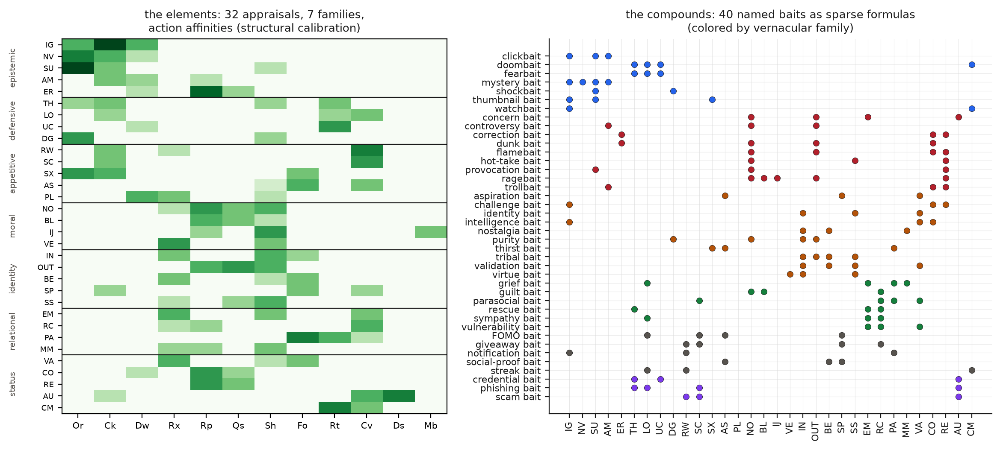

## Abstract

In December 2025 the Oxford lexicographers chose "rage bait" as their word of the year, reporting a threefold rise in use, and the internet's working vocabulary now counts dozens of named baits: clickbait, flamebait, fearbait, thirst bait, correction bait, dunk bait, FOMO bait, engagement bait. These names mix levels. Some name a target action, some an emotion, some a social outcome, some a platform objective, some a deceptive relation, and a single post can carry five of the names at once. This paper proposes that named baits are compounds rather than elements, builds the system that claim requires, and computes its structure. The architecture has four layers: about 32 candidate psychological elements in 7 appraisal families, an action alphabet of 12 from stopping the scroll to disclosing credentials, action-specific bonds between elements, and platform conditions as catalysts that multiply exposure without creating appraisal. A registry of 40 named compounds as sparse formulas, mean size 3.3, exhibits the diagnosis quantitatively: 0 formula collisions against 50 collisions in top-action space, so the names discriminate worse than the composition. A generative mechanism-to-action model with bonds turns periodicity into computation. Clustering compounds by behavioral signature alone recovers the vernacular families at purity 0.6, and the failures are the findings: ragebait is a cluster of one, fearbait files with phishing in a fear-and-return group, intelligence bait behaves as clickbait in dress clothes. The registry identifies the linear element affinities at correlation 0.95 while leaving the bond design rank-deficient by 106 parameters, so the existing vocabulary cannot identify most of its own chemistry; 382 of 496 element pairs appear in no named compound, and ranking these empty cells by predicted leverage yields a synthesis list on which the paper's two seed proposals sit mid-table, at ranks 148 and 160, behind unnamed combinations such as dread-curiosity. A held-out compound's signature is predictable from its formula at relative error 0.20 where the family mean gives 0.63, stated as internal consistency of the framework rather than empirical validation. An ecology of reinforcement-learning creators, habituating users, and engagement ranking then prices the platform's catalysis: ranking concentrates production and tilts the feed toward conflict, and the sharpest result is the counterfactual, since without habituation the feed locks onto conflict at 0.64 and never leaves, while habituating users dissolve the tilt into churn, 115 dominance switches against 0. The rage-farming dystopia assumes non-habituating users; the ecosystem's own damper is fatigue. The paper states the field programme, the Mendeleev criteria, and the kill conditions under which the periodic table would remain a metaphor.

## A word of the year and a heap of names

Chemistry before 1869 had a heap of named substances, reliable recipes, and no system; the table earned its fame by predicting elements nobody had seen (Mendeleev, 1869). The vocabulary of digital bait is at the heap stage. Oxford's lexicographers crowned "rage bait" the word of 2025, defining it as content deliberately designed to elicit anger in order to drive traffic and reporting a threefold increase in usage in 12 months (Oxford University Press, 2025). Around that word cluster dozens of siblings, and the platforms have policy categories of their own, with engagement bait defined through the actions it solicits (Meta, 2017). The names feel like species. They are not.

The diagnosis is that the vocabulary mixes levels of description. Clickbait names a target action, clicking. Ragebait names an intermediate emotional state. Flamebait names a social outcome, the reciprocal quarrel. Engagement bait names a platform objective. Bait-and-switch names a relation between preview and payload. Phishing names an extraction goal. One post can be all of these at once, and usually is. This paper's first move is to make the diagnosis quantitative: in the registry built below, no two named baits share an element formula, while 50 pairs of them collide on their top target actions. The composition discriminates where the names blur, which is the signature of a vocabulary standing at the wrong level.

The attention economy underneath is old news analytically: a wealth of information creates a poverty of attention, and whatever allocates attention becomes the scarce resource's market (Simon, 1971). What is new is the measurement opportunity. Every named bait is a folk hypothesis about human appraisal, and the folk have been prolific.

## What the record already shows

The empirical literature is better than the vocabulary and fragmented along it. On clicking: in roughly 105,000 headline experiments from the Upworthy archive, each additional negative word raised click-through by about 2.3 percent (Robertson et al., 2023); headline concreteness has non-monotonic effects, with maximal vagueness underperforming, so the curiosity gap is a tuned quantity rather than a dial (Aubin Le Quéré and Matias, 2025); and headlines labeled clickbait by detectors did not reliably attract more clicks, with 4 automated detectors agreeing on the label 47 percent of the time, which is what a category failing as a natural kind looks like (Molina, Sundar, Rony and Hassan, 2021). On sharing: moral-emotional words increase diffusion (Brady, Wills, Jost, Tucker and Van Bavel, 2017), and across 2.73 million posts, out-group language was the strongest predictor, roughly doubling sharing, a result strong enough to earn out-group reference its own element rather than a seat inside "negativity" (Rathje, Van Bavel and van der Linden, 2021). The affective machinery is not one lever: fear and anger produce opposing risk judgments because they differ on appraised certainty and control (Lerner and Keltner, 2001), which is why a theory whose primitive is "negative emotion" cannot be right. The outrage economy has its own accounting (Crockett, 2017), and outrage expression is socially learned from feedback (Brady, McLoughlin, Doan and Crockett, 2021), as is posting behavior generally, described first as reward learning (Lindström et al., 2021) and now best as a hybrid of reinforcement learning and habit in 2,696 users with a preregistered replication (Nature Communications, 2026). Post-click satisfaction diverges from clicking, formalized in recommender engineering as the clickbait issue (Wang, Feng, He, Zhang et al., 2021), and a one-line accuracy prompt shifts sharing, showing that interventions operate at the appraisal level (Pennycook, Epstein, Mosleh, Arechar et al., 2021). Ethnographically, ragebait production is formulaic and repeatable, an accountability-entertainment genre with a recipe (Reynolds and John, 2026).

Each slice is solid. What does not exist is the unified object: an ontology spanning clickbait through phishing with a common mechanism basis. The nearest methodological precedent is the harmonization of ten dark-pattern taxonomies into one multilevel ontology (Gray, Santos, Bielova and Mildner, 2024). This paper attempts the analogous move one level down, at the psychology.

## Five quantities, and never one score

A definition first, because "bait" must not mean everything attention-grabbing. Let a framing be functional bait for an action when it raises that action's probability against a content-equivalent neutral framing; the difference is its bait leverage, and it is action-specific, since a framing can raise clicking while lowering completion. Functional bait becomes strategic when the sender selected the framing to induce the action; deceptive when the preview's promise diverges from the payload's delivery; manipulative when its effectiveness depends on bypassing reflection, operationalized as an autonomy gap, the difference between immediate action under partial information and deliberated action under full information; and harmful when it produces measured welfare loss, regret, lost trust, disclosure, hostility, distorted belief. These five are separate measurements. A truthful educational teaser can carry high click leverage with no deception and positive welfare; a phishing email carries moderate leverage, extreme deception, and catastrophic harm potential. A single bait score would erase precisely the distinctions on which both ethics and moderation depend, so the theory refuses one.

Scope follows the same discipline. Persuasion is broader than bait; sensationalism is a style that may instantiate bait mechanisms; dark patterns live at the interface layer; misinformation is a truth-status category, and bait can be perfectly true; trolling is an actor's practice; queerbaiting and race-baiting are historically specific concepts owed their own treatments. The first object is digital content and interaction bait, nothing more.

## Elements, cues, actions, catalysts

The architecture has four layers, and keeping them apart is most of the theory. The elements are appraisal computations, about 32 candidates in 7 families: epistemic (information gap, novelty, surprise, ambiguity, detectable error), defensive (threat, anticipated loss, uncertainty, disgust), appetitive (reward, scarcity, sexual salience, aspiration, play), moral (norm violation, blameworthy agency, injustice, elevation), identity (in-group, out-group, belonging, social proof, self-signaling), relational (empathy, reciprocity, parasocial attachment, autobiographical memory), and status (validation, competence display, reactance, authority, commitment). Appraisal theory supplies the reason these are the primitives: emotions are the outputs of appraisals rather than their inputs (Moors, Ellsworth, Scherer and Frijda, 2013), so anger is an intermediate state and ragebait is named after its intermediate, the way "warmth" would name a reaction rather than its reagents. The elements' older names are scattered through classic social psychology: scarcity, proof, reciprocity, authority, and commitment (Cialdini, 1984), reactance (Brehm, 1966), the in-group and the out-group (Tajfel and Turner, 1979), the information gap (Loewenstein, 1994).

Cues are not elements: capital letters, red arrows, countdown timers, "only geniuses can solve this" are surface realizations, and that last one instantiates 4 elements at once. Actions are not elements either: the alphabet has 12, from orienting and clicking through replying, quote-posting, and sharing to returning, converting, disclosing, and mobilizing, and every bait deserves an action profile rather than an engagement total, because an intervention that suppresses sharing can inflate replying. And platforms are catalysts: ranking, visible counts, low friction, and personalization multiply the behavioral yield of an appraisal without creating it.

A named bait is then a sparse formula. Ragebait is norm violation plus blameworthy agency plus injustice plus out-group plus reactance; correction bait is detectable error plus competence display plus reactance; FOMO bait is scarcity plus loss plus social proof plus aspiration. The registry holds 40 such compounds across 6 vernacular families, mean formula size 3.3, no two formulas identical (Figure 1). One element appears in no named compound at all: play. The vocabulary of manipulation has no name for baiting through the promise of fun, which makes play the registry's noble gas, present in the periodic system and absent from the nomenclature of complaint.

{width=100%}

## The signatures and the redrawn families

The generative model assigns each compound a response signature: element affinities sum per action, and bonds, action-specific interactions between element pairs, add the chemistry, norm violation with out-group superadditive for sharing and quote-posting, information gap with surprise for clicking, scarcity with loss for conversion, threat with uncertainty positive for returning and negative for sharing, since what cannot be evaluated is checked and not forwarded. The calibration is structural and the paper says so plainly: these numbers are facts about the model's geometry, with directions anchored to the record above, and every downstream claim is a claim about the system's shape.

The first periodicity computation asks whether the vernacular families are visible in behavior alone. Clustering the 40 signatures with no access to names or formulas recovers the 6 families at purity 0.6, and the misfilings teach more than the recoveries (Figure 2, left). Ragebait lands in a cluster by itself: its 5-element formula with 2 bonds makes its signature unlike anything else in the registry, a behavioral outlier the lexicographers independently crowned. Fearbait and doombait file with phishing, credential bait, and streak bait in a fear-and-return group: behaviorally, doom-scrolling media and credential-harvest scams share a chassis of threat, uncertainty, and compulsive checking, which the vernacular's family lines hide. Intelligence bait and challenge bait file with clickbait: flattery about solving is curiosity in dress clothes. And the care and identity families largely fuse into a solidarity group, sympathy and tribal appeals converging on the same reaction-and-share profile. Behavior redraws the taxonomy along action profiles, and the redrawn lines are the informative ones.

## What the vocabulary cannot identify

The second computation treats the registry as an experimental design and asks what it can measure. The linear question resolves well: regressing signatures on formulas recovers the element affinities at correlation 0.95, so 40 named compounds suffice to estimate what each element does alone. The chemistry is another matter. Of 496 possible element pairs, the named compounds realize 114, and the joint design of affinities plus realized-pair interactions has rank 40 against 145 parameters, a deficit of 106: the existing vocabulary cannot identify most of its own bonds even in principle, because nobody has named the combinations that would reveal them. This is the paper's sharpest structural finding about the folk taxonomy, and it is a design statement, independent of any calibration: naming has explored barely a quarter of the pair space, and estimation cannot outrun nomenclature.

The 382 unrealized pairs are the empty cells of the table (Figure 2, right), and the model ranks them by predicted leverage into a synthesis list. The top of the list is instructive: dread-curiosity, information gap with threat, predicted to click like clickbait while retaining like fearbait, sits first, with gap-scarcity and novelty-disgust close behind. The two unnamed compounds proposed in this paper's own design phase, praise-correction bait (elevation with error and competence: publicly celebrating overlooked merit) and nostalgic-threat bait (memory with threat and in-group: the lost-world narrative), rank 148 and 160, mid-table, a small honest lesson in the difference between a theorist's intuition and a model's ranking. Their predicted signatures are computed regardless: praise-correction is a reply engine, nostalgic-threat a share engine, and both are ethically buildable stimuli, which is what makes empty cells testable.

The held-out test completes the internal audit. Withholding each compound in turn, refitting, and predicting its signature from its formula alone gives mean relative error 0.20, against 0.63 for the family-mean baseline and 0.80 for the global mean. Because the world here is generated by the compositional model, this demonstrates the logic of the Mendeleev test rather than passing it: it shows the test is well-posed and discriminating, and the paper labels it internal consistency, never validation. The real test has five criteria, stated for the field programme: compression of many names into few elements; recurring action-affinity properties within element families; prediction of compound profiles from element profiles and bonds; prediction of unnamed cells subsequently synthesized as stimuli; and generalization to held-out labels, topics, platforms, and languages. A table that cannot predict is a poster.

{width=100%}

## The ecology and the damper

Baits live in a market, and the market has three coupled learners: creators who keep what works, users who tire of what worked, and a ranking layer that multiplies what engages. The paper's third computation couples them: 60 creators choose among the 40 compounds by reinforcement learning, user susceptibility to each element depletes with exposure and recovers slowly, and exposure is either flat (chronological) or multiplied by relative engagement (ranking). The results price the catalyst (Figure 3). Engagement ranking concentrates production, Herfindahl 0.075 against 0.054, and thins diversity, entropy 2.75 against 3.07. The feed tilts toward the conflict family, 0.28 against 0.27, and the tilt is larger in the feed than in production, which is the correct decomposition of the usual complaint: ranking changes what is seen more than what is made.

The counterfactual is the finding. Freeze habituation, so users never tire, and the same ecology locks: conflict takes 0.64 of the feed, the dominant compound never changes, and the system sits in the rage-farming equilibrium the public conversation fears. Turn habituation on and the lock dissolves into churn: 115 dominance switches in the second half of the run, formats rising, exhausting their elements' susceptibility, and yielding to successors, escalation appearing as turnover rather than as monotone intensification. The ecosystem's own damper is fatigue, and the dystopian reading of engagement optimization quietly assumes non-habituating users. This is a structural result about the model, and it earns its plausibility from the learning literature it instantiates: creators do learn by reinforcement and habit (Lindström et al., 2021; Nature Communications, 2026), outrage expression does respond to feedback (Brady, McLoughlin, Doan and Crockett, 2021), and social feedback does amplify emotional language in self-exciting cascades (Luo, Sornette and Lera, 2025). What the model adds is the closed loop, in which the same learning that discovers ragebait also wears it out.

{width=100%}

## The field programme and the kill criteria

Everything above is architecture plus the computations architecture permits; the science is a field programme, and the paper specifies it rather than gesturing. A versioned registry with provenance, aliases, and confidence, built by the harmonization method the dark-patterns community has already exercised. An annotated multi-platform corpus with impression denominators, since raw engagement counts confound response with exposure. Latent-structure extraction tested for invariance across platform, language, and culture, with only stable factors admitted as elements. A preregistered factorial experiment holding payloads constant while manipulating information gap, norm violation, out-group salience, and urgency, measuring the full action profile plus appraisals, satisfaction, and delayed reflective endorsement, with sample size from simulation. Then the Mendeleev sequence: held-out compound prediction, and synthesis of empty cells as ethical stimuli, praise-correction bait first, since celebrating overlooked merit is the rare manipulation experiment nobody is harmed by.

The kill criteria are explicit. The strong claim dies if no stable primitives emerge across datasets; if mechanism vectors predict no better than vernacular labels; if the elements cannot be manipulated independently of content; if bond effects fail to replicate; if withheld compounds cannot be predicted; if user and context effects leave no content-level structure; if fidelity and intent resist reliable measurement; or if the recovered structure shows no recurring properties, in which case the table was a vocabulary with borders. The weak contribution, a layered ontology that stops category errors, survives most of these deaths, and the paper prices the two contributions separately on purpose.

## Ethics and dual use

A theory of what makes bait work is a manual for making bait work; the dual use is structural rather than incidental. Three commitments follow. The welfare axis stays separate from the efficacy axis, so nothing in the framework certifies a high-leverage design as acceptable; the autonomy gap and regret are measured rather than assumed away. Synthesis experiments use benign cells: the empty-cell list is public precisely so that the community's first syntheses can be chosen for harmlessness, and no deliberately inflammatory stimuli belong in public circulation for diffusion measurement. And the framework's moderation use, classifying content by mechanism rather than by topic or viewpoint, is the anti-censorship configuration: a mechanism ontology criticizes how content grips, never what it claims, and the distinction deserves preserving in any deployment.

## Objections

The obvious objection is that the numbers are invented: the affinities and bonds are structural calibration, so the purity, the ranks, and the ecology are facts about a constructed world. Correct, stated in every section, and the reply is the division of labor: the identifiability results are design facts independent of calibration, since rank deficits and empty cells depend only on which formulas exist; the ecology's regimes reproduce mechanisms the empirical literature documents piecewise; and the calibrated quantities exist to make the Mendeleev test well-posed before anyone spends participants on it. A second objection says the chemistry metaphor flatters the material: psychology has no conservation laws, and elements may be culturally variable. Agreed. Invariance testing gates the element list for this reason, and the paper's standard is predictive periodicity rather than ontological atomism; the metaphor is a working discipline, never a claim of physics. A third objection holds that users knowingly enjoy bait, so the manipulation frame condescends. Often true. The five-quantity decomposition exists for that case: high leverage with knowing consumption and no regret is entertainment, and the framework says so without embarrassment. A fourth objection: the taxonomy will be obsolete in a season as slang moves. The slang will move. The appraisals underneath move on evolutionary time, and the registry is versioned because names are the volatile layer over a stable one, which is the reason to build at the stable layer.

## Falsification

The paper's own computations are reproducible to the digit and falsifiable at the level of design: a registry revision that collides formulas, a clustering that fails to separate any family, or an identifiability analysis showing the bond design full-rank would each break a stated invariant. The framework fails empirically by its kill criteria above. And the paper's sharpest specific bets are exposed: that out-group reference and norm violation will show a superadditive sharing bond in factorial data; that fear-family compounds will cluster with extraction compounds on action profiles in real corpora, as they do in the model; that play-based bait exists undescribed and will be found once looked for; and that habituation dynamics will make sustained rage-farming self-limiting in creator panels, with format turnover rather than permanent capture as the observed signature. Each of these can lose against data, and the third one can lose embarrassingly, since a noble gas that turns out not to exist is a hole in the table's logic, which is how tables earn or lose their names.

## Naming and knowing

Mendeleev's table was a machine for being wrong in public rather than a filing cabinet, and its empty cells were promises that particular substances would be found with particular properties. The bait vocabulary is at the pre-table stage: rich in names, poor in structure, mixing what a thing does, how it feels, and whom it serves. The Baitome is the proposal that underneath the names sits a small set of appraisal elements, combining by learnable rules into the compounds the names gesture at, catalyzed by platforms, and metabolized by users whose fatigue is the system's forgotten regulator. The computations here show the proposal is well-posed: the composition discriminates where names collide, the vocabulary's own coverage cannot identify its chemistry, the empty cells are enumerable and rankable, and the ecology's famous pathologies are regimes of one closed loop. Whether the table is real is now a question with a procedure. Names are how a culture complains; elements would be how it understands what it is complaining about.

## Reproducibility

The simulation, its 3 figures, and every model number quoted above regenerate from one command in the paper's repository (`simulation/run_all.py`; seeded, bit for bit). 19 invariants, among them the registry's shape and sparsity, the zero formula collisions against the measured action collisions, the family-recovery purity band, the linear recoverability against the bond-design deficit, the empty-cell majority, the presence and ranking of the proposed cells, the held-out ordering of compositional over family-mean over global prediction, and the ecology's concentration, feed tilt, diversity, cycling, and no-habituation lock, fail the run loudly if broken. The external anchors quoted in prose enter results.json as cited records with sources.

## References

Aubin Le Quéré, M., and Matias, J. N. (2025). When curiosity gaps backfire: Effects of headline concreteness on information selection decisions. *Scientific Reports*, 15.

Brady, W. J., McLoughlin, K., Doan, T. N., and Crockett, M. J. (2021). How social learning amplifies moral outrage expression in online social networks. *Science Advances*, 7(33), eabe5641.

Brady, W. J., Wills, J. A., Jost, J. T., Tucker, J. A., and Van Bavel, J. J. (2017). Emotion shapes the diffusion of moralized content in social networks. *Proceedings of the National Academy of Sciences*, 114(28), 7313--7318.

Brehm, J. W. (1966). *A Theory of Psychological Reactance*. New York: Academic Press.

Cialdini, R. B. (1984). *Influence: The Psychology of Persuasion*. New York: William Morrow.

Crockett, M. J. (2017). Moral outrage in the digital age. *Nature Human Behaviour*, 1(11), 769--771.

Gray, C. M., Santos, C., Bielova, N., and Mildner, T. (2024). An ontology of dark patterns knowledge: Foundations, definitions, and a pathway for shared knowledge-building. *Proceedings of the CHI Conference on Human Factors in Computing Systems*, 1--22.

Lerner, J. S., and Keltner, D. (2001). Fear, anger, and risk. *Journal of Personality and Social Psychology*, 81(1), 146--159.

Lindström, B., Bellander, M., Schultner, D. T., Chang, A., Tobler, P. N., and Amodio, D. M. (2021). A computational reward learning account of social media engagement. *Nature Communications*, 12, 1311.

Loewenstein, G. (1994). The psychology of curiosity: A review and reinterpretation. *Psychological Bulletin*, 116(1), 75--98.

Luo, Y., Sornette, D., and Lera, S. C. (2025). Social feedback amplifies emotional language in online video live chats. *Communications Psychology*, 3.

Mendeleev, D. (1869). Über die Beziehungen der Eigenschaften zu den Atomgewichten der Elemente. *Zeitschrift für Chemie*, 12, 405--406.

Meta (2017). *News Feed FYI: Fighting Engagement Bait on Facebook*. Menlo Park, December 2017.

Molina, M. D., Sundar, S. S., Rony, M. M. U., and Hassan, N. (2021). Does clickbait actually attract more clicks? Three clickbait studies you must read. *Proceedings of the 2021 CHI Conference on Human Factors in Computing Systems*, 1--19.

Moors, A., Ellsworth, P. C., Scherer, K. R., and Frijda, N. H. (2013). Appraisal theories of emotion: State of the art and future development. *Emotion Review*, 5(2), 119--124.

Nature Communications (2026). A computational model of reward learning and habits on social media. *Nature Communications*, 17. doi:10.1038/s41467-026-73547-6.

Oxford University Press (2025). *The Oxford Word of the Year 2025 is Rage Bait*. Oxford, December 1, 2025.

Pennycook, G., Epstein, Z., Mosleh, M., Arechar, A. A., Eckles, D., and Rand, D. G. (2021). Shifting attention to accuracy can reduce misinformation online. *Nature*, 592(7855), 590--595.

Rathje, S., Van Bavel, J. J., and van der Linden, S. (2021). Out-group animosity drives engagement on social media. *Proceedings of the National Academy of Sciences*, 118(26), e2024292118.

Reynolds, C., and John, N. A. (2026). "That's not where the cart goes!": Ragebait as accountability entertainment. *Information, Communication and Society*, 1--19.

Robertson, C. E., Pröllochs, N., Schwarzenegger, K., Pärnamets, P., Van Bavel, J. J., and Feuerriegel, S. (2023). Negativity drives online news consumption. *Nature Human Behaviour*, 7(5), 812--822.

Simon, H. A. (1971). Designing organizations for an information-rich world. In M. Greenberger (ed.), *Computers, Communications, and the Public Interest*. Baltimore: Johns Hopkins Press.

Tajfel, H., and Turner, J. C. (1979). An integrative theory of intergroup conflict. In W. G. Austin and S. Worchel (eds.), *The Social Psychology of Intergroup Relations*. Monterey: Brooks/Cole.

Wang, W., Feng, F., He, X., Zhang, H., and Chua, T.-S. (2021). Clicks can be cheating: Counterfactual recommendation for mitigating clickbait issue. *Proceedings of the 44th International ACM SIGIR Conference*, 1288--1297.
