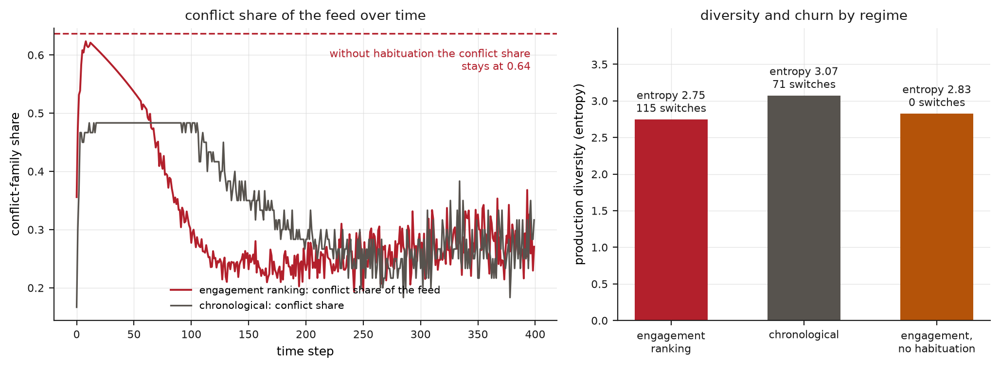

## Abstract

Oxford's lexicographers chose "rage bait" as the word of the year for 2025, reporting a threefold rise in use, and the working vocabulary of the internet now names dozens of baits: clickbait, flamebait, fearbait, thirst bait, correction bait, dunk bait, FOMO bait, engagement bait. The names mix levels of description (a target action, an emotion, a social outcome, a platform objective, a deceptive relation), and one post can carry several of them. We treat named baits as compounds of psychological elements and build a four-layer system: about 32 candidate appraisal elements in 7 families, an alphabet of 12 actions, action-specific bonds between elements, and platform conditions acting as catalysts that multiply exposure without creating appraisal. A registry of 40 named baits as sparse formulas (mean size 3.3) has 0 formula collisions against 50 collisions in top-action space. Clustering compounds by simulated behavioral signature recovers the vernacular families at purity 0.6: ragebait forms a singleton cluster, and fearbait groups with phishing. The registry identifies linear element affinities (correlation 0.95), but the bond design is rank-deficient by 106 parameters, and 382 of 496 element pairs occur in no named compound. A held-out compound's signature is predicted from its formula with relative error 0.20, against 0.63 for the family mean, a test of internal consistency only. In an ecology of learning creators, habituating users and engagement ranking, ranking concentrates production and tilts the feed toward conflict; without habituation the conflict share locks at 0.64, and with it dominance changes 115 times. We specify the field programme and the criteria under which the periodic-table analogy would fail.

## Introduction

Before 1869 chemistry had many named substances, reliable recipes and no system; the periodic table became influential by predicting elements that had not been observed [@mendeleev1869]. The vocabulary of digital bait is at the earlier stage. Oxford's lexicographers named "rage bait" the word of 2025, defining it as content deliberately designed to elicit anger in order to drive traffic, and reported a threefold increase in usage over 12 months [@oup2025]. Dozens of related terms surround it, and platforms maintain their own policy categories, defining engagement bait through the actions it solicits [@meta2017]. The names are used as if they denoted species, but they do not form a consistent classification.

The vocabulary mixes levels of description. Clickbait names a target action, clicking. Ragebait names an intermediate emotional state. Flamebait names a social outcome, the reciprocal quarrel. Engagement bait names a platform objective. Bait-and-switch names a relation between preview and payload. Phishing names an extraction goal. A single post can fit all of these. In the registry built below, no two named baits share an element formula, while 50 pairs collide on their top target actions, so the composition discriminates where the names do not.

The underlying attention economy is well described: a wealth of information creates a poverty of attention, and whatever allocates attention becomes a market for the scarce resource [@simon1971]. Each named bait also amounts to a folk hypothesis about human appraisal, and the folk vocabulary provides many such hypotheses to test.

## Prior evidence

The empirical literature is fragmented along the lines of the vocabulary. On clicking: in roughly 105,000 headline experiments from the Upworthy archive, each additional negative word raised click-through by about 2.3 percent [@robertson2023]; headline concreteness has non-monotonic effects, with maximal vagueness underperforming, so the curiosity gap has an optimum [@aubin2025]; and headlines labeled clickbait by detectors did not reliably attract more clicks, with 4 automated detectors agreeing on the label 47 percent of the time, consistent with a category that is not a natural kind [@molina2021]. On sharing: moral-emotional words increase diffusion [@brady2017], and across 2.73 million posts, out-group language was the strongest predictor, roughly doubling sharing [@rathje2021], which justifies treating out-group reference as a separate element from negativity. Fear and anger produce opposite risk judgments because they differ in appraised certainty and control [@lerner2001], so "negative emotion" cannot serve as a primitive. Outrage has its own economics [@crockett2017], and outrage expression is learned from social feedback [@brady2021], as is posting behavior generally, first described as reward learning [@lindstrom2021] and now best fitted, in 2,696 users with a preregistered replication, by a hybrid of reinforcement learning and habit [@turner2026]. Satisfaction after a click diverges from clicking, a divergence formalized in recommender engineering as the clickbait issue [@wang2021], and a one-line accuracy prompt shifts sharing, showing that interventions act at the level of appraisal [@pennycook2021]. Ethnographically, ragebait production is formulaic and repeatable, a genre of accountability entertainment with a recipe [@reynolds2026].

No unified ontology spans clickbait through phishing on a common mechanistic basis. The nearest methodological precedent is the harmonization of ten dark-pattern taxonomies into one multilevel ontology [@gray2024]. We attempt the analogous construction at the level of psychology.

## Five measures of bait

"Bait" must be defined narrowly enough to exclude everything that captures attention. A framing is functional bait for an action when it raises that action's probability relative to a content-equivalent neutral framing; the difference is its bait leverage, which is specific to the action, since a framing can raise clicking while lowering completion. Functional bait is strategic when the sender chose the framing to induce the action; deceptive when the preview's promise diverges from what the payload delivers; manipulative when its effectiveness depends on bypassing reflection, measured as an autonomy gap between immediate action under partial information and deliberated action under full information; and harmful when it produces measured welfare loss, such as regret, lost trust, disclosure, hostility or distorted belief. These five are separate measurements. A truthful educational teaser can have high click leverage with no deception and positive welfare; a phishing email has moderate leverage, extreme deception and severe potential harm. A single bait score would erase the distinctions on which ethics and moderation depend, so the framework does not define one.

The scope is limited accordingly. Persuasion is broader than bait; sensationalism is a style that may use bait mechanisms; dark patterns belong to the interface layer; misinformation is a category of truth status, and bait can be true; trolling is a practice of actors; queerbaiting and race-baiting are historically specific concepts that require their own treatment. The object here is digital content and interaction bait.

## Elements, cues, actions and catalysts

The architecture has four layers, and most of the theory consists in keeping them separate. The elements are appraisal computations, about 32 candidates in 7 families: epistemic (information gap, novelty, surprise, ambiguity, detectable error), defensive (threat, anticipated loss, uncertainty, disgust), appetitive (reward, scarcity, sexual salience, aspiration, play), moral (norm violation, blameworthy agency, injustice, elevation), identity (in-group, out-group, belonging, social proof, self-signaling), relational (empathy, reciprocity, parasocial attachment, autobiographical memory) and status (validation, competence display, reactance, authority, commitment). Appraisal theory explains why these are the primitives: emotions are outputs of appraisals [@moors2013], so anger is an intermediate state, and ragebait is named after an intermediate product. Many of the elements have established names in social psychology: scarcity, social proof, reciprocity, authority and commitment [@cialdini1984], reactance [@brehm1966], the in-group and out-group [@tajfel1979] and the information gap [@loewenstein1994].

Cues are surface realizations of elements: capital letters, red arrows, countdown timers, and phrases such as "only geniuses can solve this", which instantiates 4 elements. Actions form a separate layer, an alphabet of 12 running from orienting and clicking through replying, quote-posting and sharing to returning, converting, disclosing and mobilizing. Each bait therefore has an action profile, which an engagement total would obscure, since an intervention that suppresses sharing can increase replying. Platforms act as catalysts: ranking, visible counts, low friction and personalization multiply the behavioral yield of an appraisal without creating it.

A named bait is then a sparse formula. Ragebait is norm violation, blameworthy agency, injustice, out-group and reactance; correction bait is detectable error, competence display and reactance; FOMO bait is scarcity, loss, social proof and aspiration. The registry holds 40 such compounds in 6 vernacular families, with mean formula size 3.3 and no two formulas identical (Figure 1). One element, play, appears in no named compound: the vocabulary has no term for baiting through the promise of fun, although the element belongs in the system.

{width=100%}

## Behavioral signatures and family recovery

The generative model assigns each compound a response signature. Element affinities sum within each action, and bonds, action-specific interactions between element pairs, add nonadditive terms: norm violation with out-group is superadditive for sharing and quote-posting, information gap with surprise for clicking, scarcity with loss for conversion, and threat with uncertainty is positive for returning and negative for sharing, since content that cannot be evaluated is checked and not forwarded. The calibration is structural: the numbers describe the model's geometry, with directions anchored to the evidence above, and every downstream claim concerns the shape of the system.

The first computation asks whether the vernacular families are visible in behavior alone. Clustering the 40 signatures without access to names or formulas recovers the 6 families at purity 0.6, and the misassignments are informative (Figure 2, left). Ragebait forms a cluster by itself: its 5-element formula with 2 bonds gives it a signature unlike any other in the registry. Fearbait and doombait group with phishing, credential bait and streak bait in a fear-and-return cluster, because doom-scrolling media and credential-harvesting scams share a basis of threat, uncertainty and compulsive checking that the vernacular families separate. Intelligence bait and challenge bait group with clickbait, since flattery about solving a puzzle acts through curiosity. The care and identity families largely merge into a solidarity group, as appeals to sympathy and to group loyalty converge on the same profile of reacting and sharing. Behavioral signatures thus redraw the taxonomy along action profiles.

## Identifiability of the registry

The second computation treats the registry as an experimental design and asks what it can estimate. Regressing signatures on formulas recovers the element affinities at a correlation of 0.95, so 40 named compounds suffice to estimate what each element does alone. The bonds are another matter. Of 496 possible element pairs, the named compounds realize 114, and the joint design of affinities and realized-pair interactions has rank 40 against 146 parameters, a deficit of 106. The existing vocabulary therefore cannot identify most of its own bonds even in principle, because the combinations that would reveal them have not been named. This result depends only on which formulas exist and is independent of calibration: naming has covered less than a quarter of the pair space, and estimation cannot go beyond it.

The 382 unrealized pairs are the empty cells of the table (Figure 2, right), and the model ranks them by predicted leverage. The top-ranked cell is dread-curiosity, information gap with threat, predicted to attract clicks like clickbait and return visits like fearbait, followed by gap-scarcity and novelty-disgust. Two compounds proposed during the design of the registry, praise-correction bait (elevation with error and competence: publicly celebrating overlooked merit) and nostalgic-threat bait (memory with threat and in-group: the narrative of a lost world), rank 148 and 160, in the middle of the list, below many unnamed combinations. Their predicted signatures make praise-correction bait a driver of replies and nostalgic-threat bait a driver of shares, and both can be built ethically as stimuli, which makes the empty cells testable.

A held-out test completes the internal audit. Withholding each compound in turn, refitting, and predicting its signature from its formula alone gives a mean relative error of 0.20, against 0.63 for the family-mean baseline and 0.80 for the global mean. Because the data are generated by the compositional model, this test shows that the Mendeleev test is well-posed and discriminating; it does not pass that test, and we treat it as internal consistency. The empirical test has five criteria: compression of many names into few elements; recurring action-affinity properties within element families; prediction of compound profiles from element profiles and bonds; prediction of unnamed cells subsequently synthesized as stimuli; and generalization to held-out labels, topics, platforms and languages. A table that fails to predict is a classification scheme only.

{width=100%}

## Creator-user-platform ecology

Baits are produced and consumed in a market with three coupled learners: creators who keep what works, users who tire of what has worked, and a ranking layer that multiplies what engages. The third computation couples them. Sixty creators choose among the 40 compounds by reinforcement learning, user susceptibility to each element depletes with exposure and recovers slowly, and exposure is either flat (chronological) or multiplied by relative engagement (ranking). Engagement ranking concentrates production, with a Herfindahl index of 0.075 against 0.054, and reduces diversity, with entropy 2.75 against 3.07 (Figure 3). The feed shifts toward the conflict family, 0.28 against 0.27, and the shift is larger in the feed than in production, so ranking changes what is seen more than what is made.

The counterfactual without habituation is the main ecological result. When users never tire, the same ecology locks: conflict takes 0.64 of the feed, the dominant compound never changes, and the system remains in the rage-farming equilibrium described in public debate. With habituation the lock gives way to turnover, with 115 changes of the dominant compound in the second half of the run under ranking, as formats rise, exhaust their elements' susceptibility and are replaced. Escalation appears as turnover of formats. Accounts of engagement optimization that predict permanent capture by outrage implicitly assume users who do not habituate. The result is a property of the model, and its plausibility rests on the learning literature it instantiates: creators learn by reinforcement and habit [@lindstrom2021; @turner2026], outrage expression responds to feedback [@brady2021], and social feedback amplifies emotional language in self-exciting cascades [@luo2025]. The model adds the closed loop in which the learning that discovers ragebait also exhausts it.

{width=100%}

## Field programme and failure criteria

The computations above establish the architecture; the empirical work is a field programme with five components. The first is a versioned registry with provenance, aliases and confidence levels, built by the harmonization method already applied to dark patterns. The second is an annotated multi-platform corpus with impression denominators, since raw engagement counts confound response with exposure. The third is extraction of latent structure tested for invariance across platform, language and culture, with only stable factors admitted as elements. The fourth is a preregistered factorial experiment holding payloads constant while manipulating information gap, norm violation, out-group salience and urgency, measuring the full action profile together with appraisals, satisfaction and delayed reflective endorsement, with sample size set by simulation. The fifth is the Mendeleev sequence: prediction of held-out compounds and synthesis of empty cells as ethical stimuli, starting with praise-correction bait, since celebrating overlooked merit harms no participant.

The strong claim fails if no stable primitives emerge across datasets; if mechanism vectors predict no better than vernacular labels; if the elements cannot be manipulated independently of content; if bond effects fail to replicate; if withheld compounds cannot be predicted; if user and context effects leave no content-level structure; if fidelity and intent cannot be measured reliably; or if the recovered structure shows no recurring properties. A weaker contribution, a layered ontology that prevents category errors, survives most of these failures, and the two contributions are assessed separately.

## Ethics and dual use

A theory of what makes bait effective is also a manual for producing it. Three commitments follow. The welfare axis is kept separate from the efficacy axis, so the framework never certifies a high-leverage design as acceptable, and the autonomy gap and regret are measured. Synthesis experiments use benign cells: the empty-cell list is public so that the first syntheses can be chosen for harmlessness, and deliberately inflammatory stimuli are not released for diffusion measurement. In moderation, the framework classifies content by mechanism and not by topic or viewpoint, so it evaluates how content captures attention and not what it asserts, and deployments should preserve that restriction.

## Objections

The first objection is that the numbers are invented, since the affinities and bonds are structural calibration and the purity, ranks and ecology are therefore properties of a constructed world. This is correct and is stated in each section. The identifiability results depend only on which formulas exist and are independent of calibration; the ecological regimes reproduce mechanisms documented piecemeal in the empirical literature; and the calibrated quantities make the Mendeleev test well-posed before participants are recruited. A second objection is that the chemical analogy flatters the material, since psychology has no conservation laws and elements may vary across cultures. Invariance testing gates the element list for this reason, and the standard is predictive periodicity; the analogy is a working discipline and makes no physical claim. A third objection holds that users often knowingly enjoy bait, so a framing in terms of manipulation is condescending. This is often true, and the five-measure decomposition handles it: high leverage with knowing consumption and no regret is entertainment. A fourth objection is that the taxonomy will be obsolete within a season as slang changes. The slang will change, but the underlying appraisals change on evolutionary timescales, and the registry is versioned because names are the volatile layer above a stable one.

## Falsification

The computations are reproducible to the digit and falsifiable at the level of design: a registry revision that produces formula collisions, a clustering that separates no family, or an identifiability analysis showing a full-rank bond design would each break a stated invariant. The framework fails empirically under the criteria above. Four specific predictions are exposed: out-group reference and norm violation will show a superadditive sharing bond in factorial data; fear-family compounds will cluster with extraction compounds on action profiles in real corpora, as they do in the model; bait based on play exists undescribed and will be found when sought; and habituation will make sustained rage-farming self-limiting in creator panels, with turnover of formats as the observed signature. The third prediction is the most exposed, since an element that does not exist would leave a gap in the logic of the table.

## Conclusion

Mendeleev's table stated testable predictions, and its empty cells specified substances with particular properties that were later found. The vocabulary of bait is rich in names and poor in structure, and mixes what content does, how it feels and whom it serves. The proposal is that beneath the names lies a small set of appraisal elements that combine by learnable rules into the compounds the names describe, catalyzed by platforms and moderated by user fatigue. The computations show that the proposal is well-posed: the composition discriminates where names collide, the vocabulary's coverage cannot identify its own interactions, the empty cells can be enumerated and ranked, and the pathologies attributed to engagement ranking appear as regimes of one closed loop. Whether the table describes real structure can now be tested by a defined procedure.

## Reproducibility

The simulation, its 3 figures and every model number quoted above regenerate from one command in the repository (`simulation/run_all.py`; seeded, bit for bit). 19 invariants fail the run if broken, among them the registry's shape and sparsity, zero formula collisions against the measured action collisions, the band for family-recovery purity, linear recoverability against the bond-design deficit, the majority of empty cells, the presence and ranking of the proposed cells, the held-out ordering of compositional over family-mean over global prediction, and the ecology's concentration, feed shift, diversity, turnover and no-habituation lock. External anchors quoted in the text enter results.json as cited records with sources.

## References
